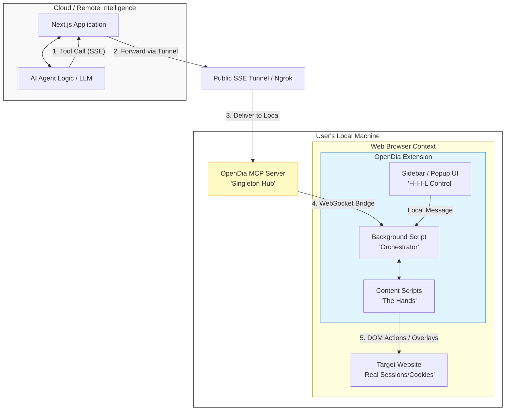

# OpenDia System Architecture & Interaction Design

OpenDia is a **Shared Reality** framework designed for collaborative, human-in-the-loop browser automation. Unlike traditional automation tools that operate in isolation, OpenDia bridges the gap between local user environments and remote AI intelligence.

## 🏗️ System Topology: The "Bridge" Pattern

The system is architected as a series of nested subsystems that span from remote cloud services to your local device.

---

## 🎭 Core Scenario: A Human-Agent Session

To understand the architecture, consider this end-to-end workflow:

### 1. The Setup (Local)
The user boots their machine and starts the **OpenDia MCP Server** as a singleton service. This server acts as the local air-traffic controller, waiting for instructions. At the same time, the **Browser Extension** establishes a persistent WebSocket connection to this local server.

### 2. The Instruction (Cloud)
The user visits a **Next.js Web Application** where a specialized AI Agent lives. The user asks: *"Research these companies on LinkedIn and export their current headcounts."*

### 3. The Instruction Chain
*   **The Brain**: The Agent (in the Cloud) decides to use the `page_navigate` tool.
*   **The Delivery**: The Next.js app sends this command through an **SSE (Server-Sent Events) Tunnel** directly to the user's **Local MCP Server**.
*   **The Bridge**: The MCP Server routes this to the **Extension Background Script**.

### 4. Smart Execution (The Library)
Rather than writing raw JavaScript for every click, the Extension utilizes a **Script Execution Engine** with two layers:
*   **Pre-injected Utilities**: A "Standard Library" of optimized functions for form-filling, robust clicking (bypassing CSP), and pattern recognition.
*   **Dynamic Scripts**: Bespoke code generated by the Agent for unique, one-off page analysis.

### 5. Human-in-the-Loop (Shared Reality)
If the Agent encounters a LinkedIn bot-check or an ambiguous "Headcount" label, it invokes `select_element`. 
*   **The UI**: A prompt appears in the user's browser via a **Content Script overlay**.
*   **The Input**: The user hovers over the correct element and clicks. 
*   **The Loop**: The result is sent back up the chain to the Cloud Agent, which now has the high-fidelity metadata (CSS selector, HTML snippet) to continue the task autonomously.

---

## 🧩 Architectural Components

### 1. The Local MCP Server (The Singleton Hub)
*   **Role**: A stateless broker that remains running regardless of which agent is active.
*   **Why**: By running it as a singleton, you can connect multiple agents (Claude Desktop, Cursor, and the Next.js Web App) to the same browser concurrently without resource conflicts.

### 2. The Extension Subsystem
*   **Background Script (BSO)**: The "Orchestrator." It maintains the connection to the MCP server and manages the lifecycle of the Sidebar and Content Scripts.
*   **Content Scripts (CS)**: The "Hands." Injected into web pages to actually touch the DOM. They provide the visual pulse cursors and toast notifications during selection.
*   **Sidebar/Popup UI**: The "Cockpit." Allows the human to see what the agent is doing, review extracted data, or manually override the agent's actions.

### 3. The Intelligence Layer (External)
*   **Next.js Agent**: A modern, web-based interface that leverages the MCP protocol to delegate browser actions to the user's local hardware. This keeps the complex AI logic in the cloud while maintaining execution on the "edge" (the user's browser).

---

## 🔒 Security & Context
OpenDia's primary architectural advantage is **Context Parity**. Because the automation runs in your real browser:
*   **Authentication**: It uses your existing cookies and sessions. No 2FA scripts required.
*   **Integrity**: Actions are indistinguishable from human activity because they originate from a genuine browser environment with real fingerprints and history.
