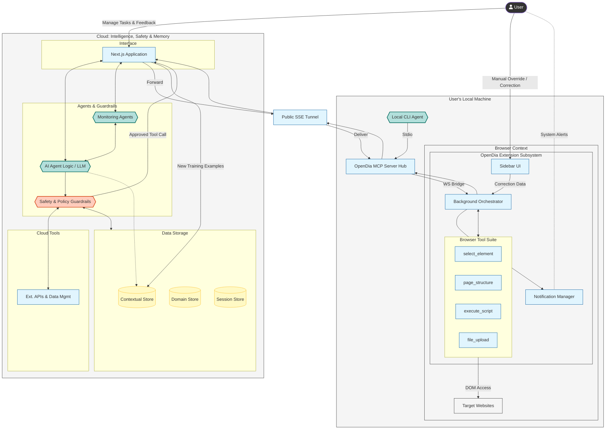

# OpenDia System Architecture & Interaction Design

OpenDia is a **Shared Reality** framework designed for collaborative, human-in-the-loop browser automation. Unlike traditional automation tools that operate in isolation, OpenDia bridges the gap between local user environments and remote AI intelligence.

## 🏗️ System Topology: The "Bridge" Pattern

The system is architected as a series of nested subsystems that span from remote cloud services to your local device.

---

## 🎭 Core Scenario: A Human-Agent Session

To understand the architecture, consider this end-to-end workflow:

### 1. The Setup (Local)
The user boots their machine and starts the **OpenDia MCP Server** as a singleton service. This server acts as the local air-traffic controller, waiting for instructions. At the same time, the **Browser Extension** establishes a persistent WebSocket connection to this local server.

### 2. The Instruction (Cloud)
The user visits a **Next.js Web Application** where a specialized AI Agent lives. The user asks: *"Research these companies on LinkedIn and export their current headcounts."*

### 3. The Instruction Chain
*   **The Brain**: The Agent (in the Cloud) decides to use the `page_navigate` tool.
*   **The Delivery**: The Next.js app sends this command through an **SSE (Server-Sent Events) Tunnel** directly to the user's **Local MCP Server**.
*   **The Bridge**: The MCP Server routes this to the **Extension Background Script**.

### 4. Smart Execution (The Library)
Rather than writing raw JavaScript for every click, the Extension utilizes a **Script Execution Engine** with two layers:
*   **Pre-injected Utilities**: A "Standard Library" of optimized functions for form-filling, robust clicking (bypassing CSP), and pattern recognition.
*   **Dynamic Scripts**: Bespoke code generated by the Agent for unique, one-off page analysis.

### 5. Human-in-the-Loop (Shared Reality)
If the Agent encounters a LinkedIn bot-check or an ambiguous "Headcount" label, it invokes `select_element`. 
*   **The UI**: A prompt appears in the user's browser via a **Content Script overlay**.
*   **The Input**: The user hovers over the correct element and clicks. 
*   **The Loop**: The result is sent back up the chain to the Cloud Agent, which now has the high-fidelity metadata (CSS selector, HTML snippet) to continue the task autonomously.

---

---

## 🌍 OpenDia's Role in the Broader Ecosystem

It is important to distinguish between **OpenDia** (the tool) and the **System** (the solution).

*   **OpenDia (The Bridge)**: OpenDia itself is strictly the **Execution & Connectivity Layer**. Its responsibility is to provide a reliable, low-latency pipe into the browser and a suite of atomic tools (click, select, extract) that are robust against modern web defenses (CSP, Shadow DOM). It is **unopinionated** about the business logic.
*   **The System (The Intelligence)**: The logic, storage, task scheduling, and domain-specific agents live *outside* OpenDia. They treat OpenDia as a powerful peripheral device. This separation allows OpenDia to be used as a:
    *   **Library**: A dependency for a local CLI tool.
    *   **component**: A headless execution engine for a cloud scraper.
    *   **Companion**: A visual sidekick for a Next.js SaaS application.

## ⚖️ Architectural Considerations & Constraints

### 1. Extension vs. Native Code
We prioritize running logic inside the **Chrome Extension** (JavaScript) over the **MCP Server** (Node.js/Python) whenever possible.
*   **Why**: Extensions have privileged access to browser APIs (Tabs, Bookmarks, Cookies) and share the exact network stack of the user.
*   **Constraint**: Chrome Extensions cannot execute arbitrary external binaries. Therefore, heavy computation (e.g., local vision models) or file system operations must be offloaded to the MCP Server, which acts as the "Sidecar" for the extension.

### 2. The "Optimized Tool Injection" Pattern
A key architectural goal is **Operational Efficiency**. We do not want the Agent to write raw JavaScript for every interaction (slow, error-prone).
*   **Strategy**: We continuously identify common patterns (e.g., "Scrape Amazon Product", "Extract LinkedIn Profile") and compile them into optimized **Utility Scripts**.
*   **Deployment**: These scripts are served via the Extension and injected into the page context.
*   **Benefit**: The Agent simply calls `extract_product()` instead of generating 50 lines of fragile `document.querySelector` logic. OpenDia serves as the **Runtime Container** for these optimized tools.

### 3. UI Customization
While OpenDia provides the "Bridge," the **Human UI** (Sidebar) is designed to be extensible.
*   **Constraint**: We avoid baking complex business logic into the Extension's native UI.
*   **Solution**: The Sidebar should primarily serve as a **View Container** that renders remote UI or adaptive cards sent by the Agent, keeping the extension lightweight and the logic centralized in the Cloud/Application layer.

---

## 🧩 Architectural Components

### 1. The Extension Subsystem (The "Hands & Eyes")
-   **Content Scripts (CS)**: Injected into web pages to actually touch the DOM. They provide the visual pulse cursors and toast notifications during selection.
-   **Background Script (BG)**: The "Orchestrator." It maintains the connection to the MCP server and manages the lifecycle of the Sidebar and Content Scripts.
-   **Sidebar/Popup UI**: The "Cockpit." Allows the human to see what the agent is doing, review extracted data, or manually override the agent's actions (**Run Task**, **Perform Adhoc Task**, **Save Task for Later**).

### 2. The Local MCP Server (The "Bridge")
-   **Role**: A stateless, singleton broker that translates agent intents into browser commands.
-   **Connectivity**: Allows multiple agents (Cloud-based, CLI, or IDE) to share the same browser context simultaneously.

### 3. The Cloud Infrastructure (The "Brain & Memory")
-   **Intelligence Layer**:
    -   **AI Agent (LLM)**: Core reasoning engine that decides which tools to invoke based on user goals.
    -   **Monitoring Agents**: Specialized observers that track recurring tasks, identify bottlenecks, and deploy optimized browser utilities.
-   **Advanced Tooling**: The Agent can query **External APIs** and perform complex **Data Management** across your domain datasets.
-   **Backend Storage**:
    -   **Contextual Store**: Captures "Learnings" and past experiences to refine future reasoning.
    -   **Domain Store**: Holds structured domain objects extracted from the web to guide future tasks.
    -   **Session Store**: Manages transient state and agent memory for active workflows.

---

## 🔒 Security & Context
OpenDia's primary architectural advantage is **Context Parity**. Because the automation runs in your real browser:
*   **Authentication**: It uses your existing cookies and sessions. No 2FA scripts required.
*   **Integrity**: Actions are indistinguishable from human activity because they originate from a genuine browser environment with real fingerprints and history.
