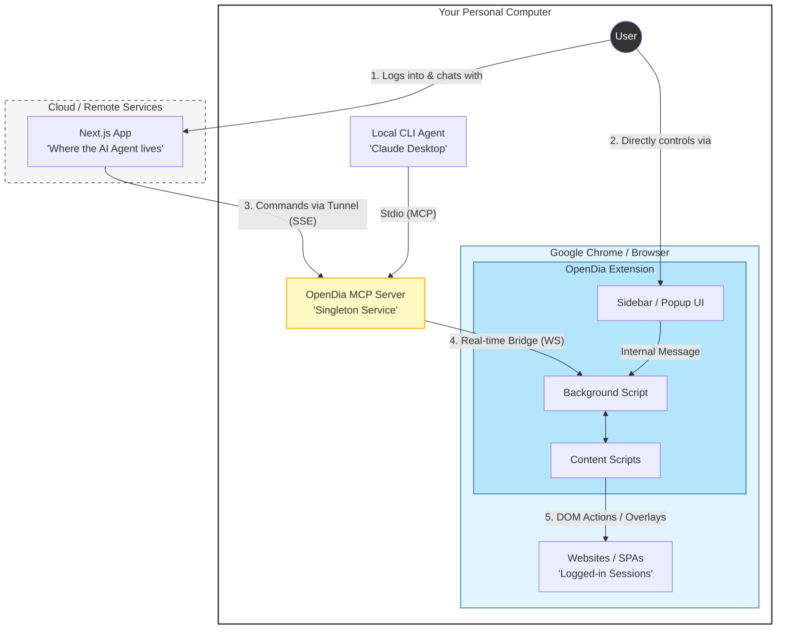
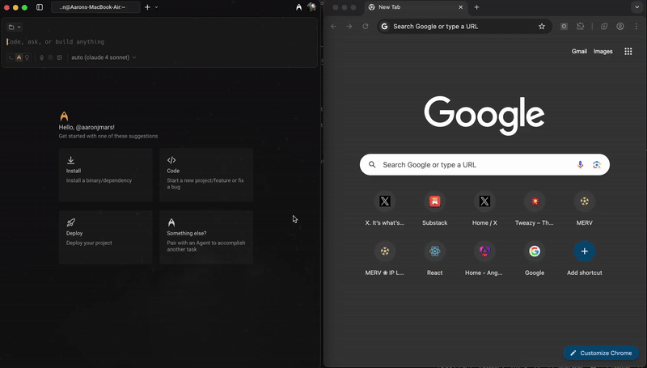

# OpenDia 

**The open alternative to Dia / Perplexity Comet**  
Connect your browser to AI models—works seamlessly with Chrome, Firefox, and any Chromium browser.

### 📝 Project Summary
OpenDia is a powerful "Shared Reality" bridge between AI agents and your browser. Unlike traditional automation, it runs as a native extension, utilizing your real sessions and cookies. This fork introduces **Human-In-The-Loop (HIIL)** capabilities, allowing agents to collaborate directly with you on complex tasks through visual overlays and custom interactive tools.

---

## 🎯 Select Element Tool (Collaborative HIIL)

**NEW in this fork:** Premium interactive element selection designed for collaborative **human-in-the-loop (HIIL)** workflows.


This tool bridges the gap between autonomous agents and human intuition. When an agent is unsure about a specific element (e.g., identifying a "Submit" button in a complex SPA), it can call `select_element` to engage the user.

- **Contextual Instruction**: Pass a custom `message` to the user in a sticky toast.
- **Visual Feedback**: Pulsing blue circular cursor and real-time element highlighting.
- **Structured Hand-off**: Agent receives CSS paths, attributes, HTML snippets, and parent hierarchy.
- **Safety**: Built-in "Cancel" and ESC key support.

---

## 📊 Key Features & Fork Additions

| Feature | Origin | Status | Description |
|---------|--------|--------|-------------|
| **`select_element` Tool** | ✨ Fork | ✅ GA | Premium HIIL selection with toast, pulse cursor, and custom instructions |
| **`page_execute_script` Tool** | ✨ Fork | ✅ Working | Execute JS in page context, bypassing CSP (Great for data extraction) |
| **`page_structure` Tool** | ✨ Fork | 🚧 WIP | Intelligent page analysis with repeated pattern detection |
| **SSE Transport** | ✨ Fork | ✅ Working | Connect remote AI agents via HTTP/SSE |
| **Universal Automation** | 🏛️ Upstream | ✅ Working | Navigate, click, fill forms, and manage tabs across any site |
| **Anti-Detection** | 🏛️ Upstream | ✅ Working | Specialized bypasses for Twitter/X, LinkedIn, and Facebook |

---

## 🚀 Quick Start

### 1. Install the Extension
- **Chrome/Arc/Edge**: Load `opendia-extension/dist/chrome` as an **Unpacked Extension** in `chrome://extensions/`.
- **Firefox**: Load `manifest.json` from `opendia-extension/dist/firefox` as a **Temporary Add-on** in `about:debugging`.

### 2. Connect to Your AI
Add this to your Claude Desktop or Cursor configuration:
```json
{
  "mcpServers": {
    "opendia": {
      "command": "npx",
      "args": ["-y", "opendia"]
    }
  }
}
```
*Or run locally:* `npx opendia` (Standard) or `npx opendia --tunnel` (for online AI access via ngrok).

---

## 📽️ Example Workflows

- **Social Media**: *"Summarize this article and post it as a thread to my Twitter account"* (Uses anti-detection bypass).
- **Research**: *"Find all GitHub repos I visited today and summarize their READMEs."*
- **HIIL Debugging**: *"I can't find the checkout button on this page, can you point it out for me?"* (Triggers `select_element`).
- **Development**: *"Fill out this signup form with test data and verify the validation errors."*

---

---

## 🧭 Why OpenDia? (Strategy & Comparison)

While general-purpose browser automation tools exist, OpenDia takes a **bespoke extension-first approach** to solve enterprise and agentic challenges that standard frameworks struggle with:

### 🚀 Beyond Standard Automation
*   **Custom Tooling**: We build specialized capabilities that aren't supported efficiently elsewhere. Example: Our `file_upload` tool can target native file input boxes directly via the extension API, bypassing the friction of complex Playwright/Puppeteer scripts.
*   **Zero-Detection Surface**: By running inside your actual browser as an extension, OpenDia leverages your real sessions, cookies, and fingerprint. This avoids the "bot detection" hurdles that often break headful automation in social media or banking contexts.
*   **Infinite Extensibility**: Need a tool that interacts with a specific Chrome API (like bookmarks, tabs, or devtools)? We can wrap it into an MCP tool in minutes, something heavy-weight automation drivers aren't designed for.
*   **Seamless HIIL**: Unlike dedicated browser environments that isolate the agent, OpenDia lives in **your** browser. This enables unique "shared reality" interactions where you and the AI can collaborate on the same page simultaneously using visual overlays.

---

## 🏗️ How It Works (System Topology)



### 📡 System Responsibilities & Location

1.  **The Cloud Agent**: When you use our **Next.js Web Application**, the AI reasoning and "brain" (Agent) are running on our servers. It connects back to your machine via a secure **SSE (Server-Sent Events) Tunnel**.
2.  **Your Machine**: 
    *   **OpenDia MCP Server**: Runs locally as a lightweight "bridge." It waits for commands from either the cloud agent or a local agent (like Claude Desktop).
    *   **The Extension**: Injected into your Chrome browser. It maintains a **WebSocket** connection to the local server, staying ready to execute commands in any tab.
3.  **Human Interaction Points**:
    *   **Web App**: You chat with the remote agent to give high-level instructions.
    *   **Extension Sidebar**: You use this for native manual controls, monitoring agent actions, or providing instant feedback (HIIL).
4.  **Shared Reality Execution**: Whether triggered from the cloud or your terminal, actions happen in your **real Chrome instance**. This means the agent uses your actual browser sessions, cookies, and local data—no separate bot environment or fragile proxying required.

---

## 🔒 Security & Privacy

- **100% Local**: No cloud processing of your browsing data, cookies, or history.
- **User Controlled**: The extension only acts when triggered by an MCP request you authorized.
- **Transparent**: Open-source and auditable. No telemetry or tracking.

---

## 🤝 Contributing & Roadmap

See [VISION.md](./VISION.md) for philosophy and [ROADMAP.md](./ROADMAP.md) for upcoming features.

**Development Setup:**
```bash
git clone https://github.com/rothnic/opendia.git
cd opendia/opendia-mcp && npm install && npm start
# Load extension from opendia-extension/dist/chrome
```

**License:** MIT - see [LICENSE](LICENSE) for details.

---

### 📺 System Overview (Upstream Preview)

